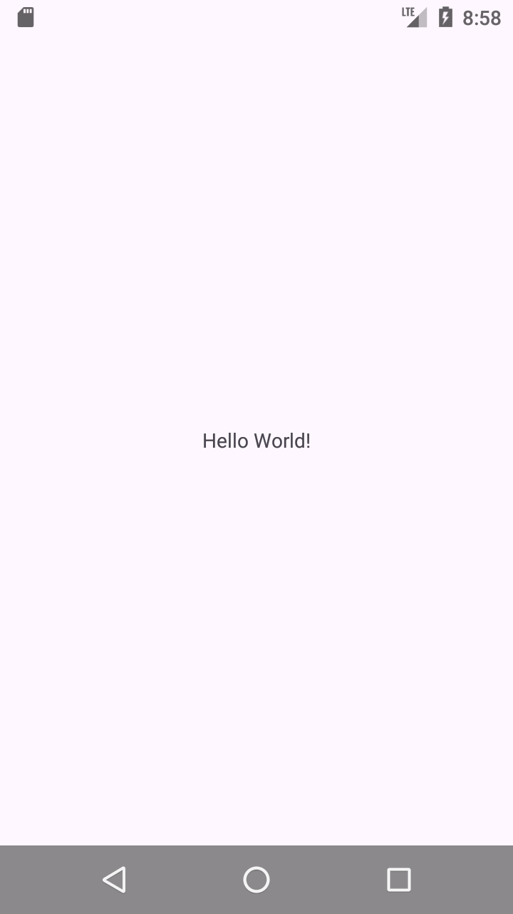
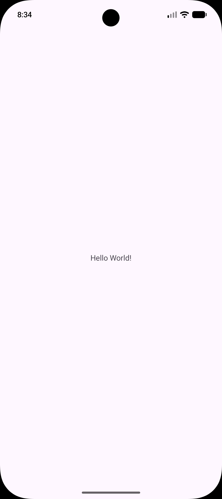
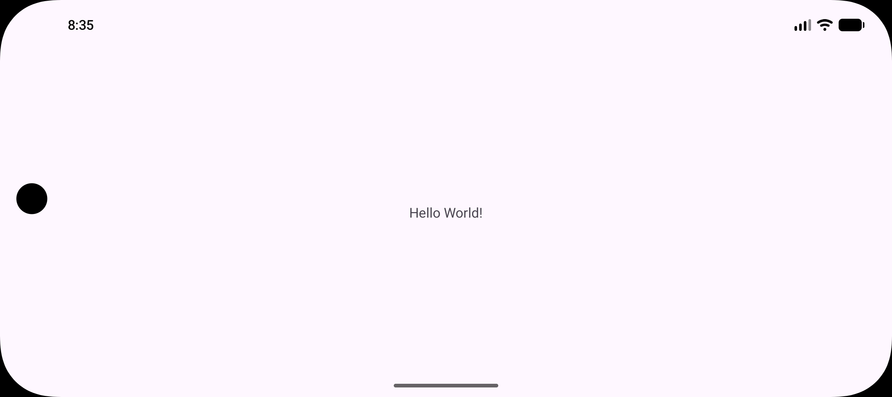
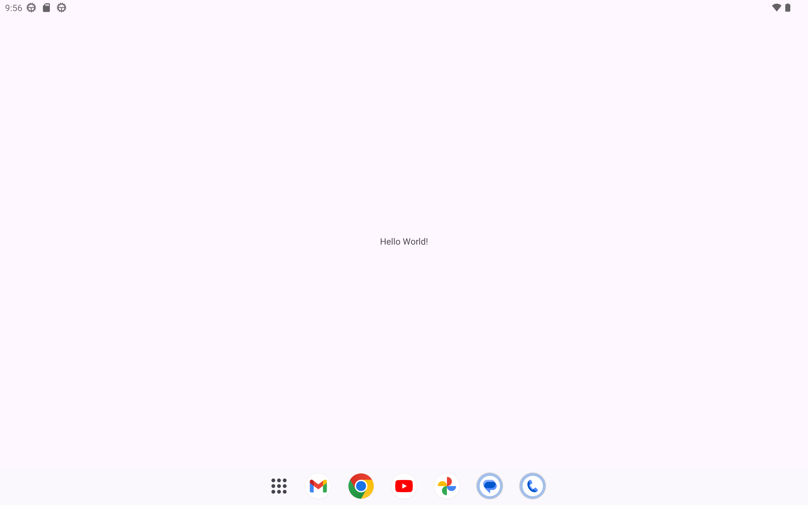
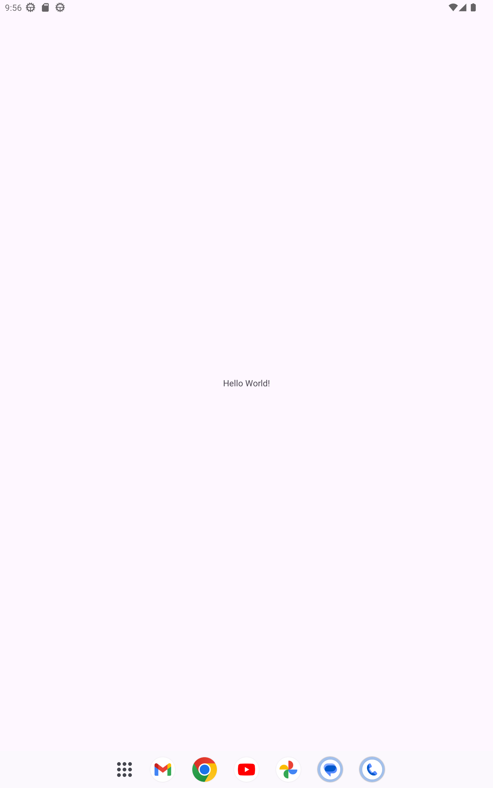

# Configuración del entorno y pruebas en distintos AVD

He instalado Android Studio con su SDK, he creado un proyecto vacío y lo he ejecutado en tres 
dispositivos virtuales (AVD) con perfiles distintos: un teléfono actual, un teléfono pequeño y 
antiguo, y una tablet. El objetivo era comprobar cómo se comporta una misma app según el dispositivo
y probar la rotación de pantalla.

**AVD 1: Teléfono pequeño y antiguo**

| Dato           | Valor                     |
|----------------|---------------------------|
| Perfil         | Small phone (Android 7.0) |
| API            | 24                        |
| Densidad(dpi)  | 320                       |
| Resolucion(px) | 720 x 1280                |

    

**AVD 2: Teléfono actual**

| Dato           | Valor                    |
|----------------|--------------------------|
| Perfil         | Pixel 10a (Android 17.0) |
| API            | 37.2                     |
| Densidad(dpi)  | 420                      |
| Resolucion(px) | 1080 x 2424              |

    

**AVD 3: Tablet**

| Dato           | Valor                      |
|----------------|----------------------------|
| Perfil         | Pixel Tablet(Android 13.0) |
| API            | 33                         |
| Densidad(dpi)  | 320                        |
| Resolucion(px) | 2560 x 1600                |

  

### Comentario de diferencias 

Al ejecutar el mismo proyecto en los tres dispositivos he visto que la app se comporta igual a nivel
funcional, pero se ve distinta según la pantalla.

**Teléfono antiguo (Android 7, API 24)**. Es el de pantalla más pequeña y menor resolución. Se nota
que es un sistema viejo: usa la navegación clásica de tres botones (atrás, inicio y recientes) en 
una barra gris que ocupa espacio, y la barra de estado tiene un aspecto más antiguo. Al girarlo, la 
barra de navegación se mueve al lateral derecho y el contenido pierde bastante alto útil, aunque el 
texto sigue centrado. Es el caso en el que el texto se ve proporcionalmente más grande respecto a la
pantalla.

**Teléfono actual (Android 17, API 37)**. Tiene la pantalla más alargada y de mayor resolución, con 
esquinas redondeadas, cámara frontal en forma de agujero y navegación por gestos (una línea fina 
abajo en lugar de botones). La app ocupa toda la pantalla y se ve más limpia. Al girarlo, la cámara 
pasa al lateral izquierdo, la barra de estado queda arriba y el texto sigue en el centro, pero 
rodeado de mucho espacio en blanco porque no hay ningún diseño pensado para horizontal.

**Tablet (Android 13, API 33)**. Es donde más se nota que la app no está adaptada. El texto es 
diminuto en comparación con una pantalla enorme y queda perdido en el centro. Además, aparece el dock con las
apps (Gmail, Chrome, YouTube...) en la parte inferior, algo propio de las tablets. Al girarla, pasa 
lo mismo: el texto sigue en el centro, todavía más pequeño respecto al espacio disponible, y el dock
se mantiene abajo.

### Conclusion:

He demostrado que una misma app puede verse y comportarse de forma distinta según el dispositivo,
aunque el código sea idéntico. La rotación funciona sola, pero adaptar el diseño a cada tamaño de 
pantalla no. Por eso conviene probar siempre en varios perfiles y diseñar interfaces adaptables 
desde el principio.