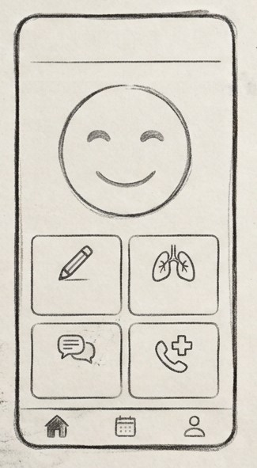
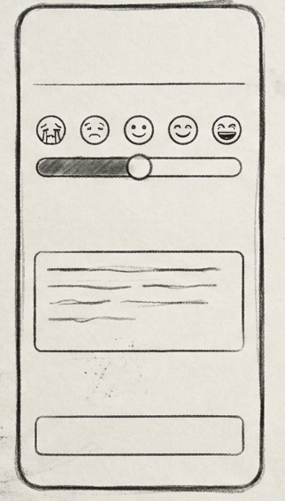
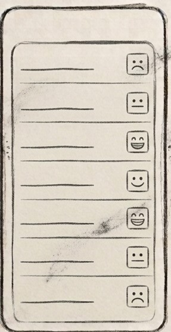
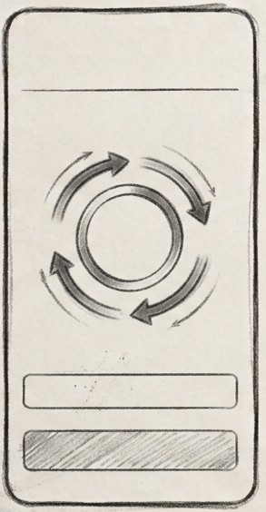
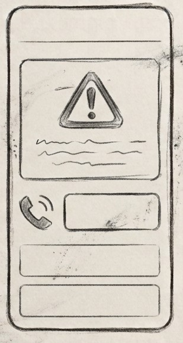

# Plantilla: propuesta del Proyecto A

---

## 0 · Datos

|                      |                          |
|----------------------|--------------------------|
| **Nombre de la app** | MindFlow                 |
| **Autor/a**          | Sonia Gonzalez Rodriguez |
| **Fecha**            | 30/09/2026               |

---

## 1 · La idea en una frase

> 
> Una app que permite a los usuarios jovenes realizar un seguimiento diario de sus emociones
para mejorar tu salud mental y el bienestar diario.

## 2 · El problema

>  La salud mental de los jovenes de entre 16 y 30 años ha empeorado bastante aumentando la sensacion
> de ansiedad, estres o depresion.
> Hoy en dia, se acude a consultas de profesionales psicologos siendo muy caras sin poder acabar
> la terapia. Ademas de libros de autoayuda genericos que no te solucionan las dudas personales y
> como afrontarlas.

---

## 3 · Personas usuarias

> Lucas, 16 años, de habla hispana, que este familiarizado con uso de la tecnologia, que pueda 
> usarlo en el momento que la necesite como antes de un examen, en casa, en la biblioteca, se dedica
> 2-3 minutos de uso cada vez y si no tiene conexion, la app sigue funcionando porque guarda los 
> datos en el movil, y en la pantalla de Ayuda tiene telefonos de apoyo como el 024.

---

## 4 · Funcionalidades

### Imprescindibles (sin esto la app no tiene sentido)

| #    | Funcionalidad                                                                             |
|------|-------------------------------------------------------------------------------------------|
| F1   | Registro diario del estado de animo (escala de 1 a 5 con emojis)                          |
| F2   | Historial lista de los registros guardados.                                               |
| F3   | Ejercicio de respiracion con audio relajante y fondo que se oscurece solo si hay poca luz |
| F4   | Consejo de bienestar del dia, obtenido de internet                                        |

### Opcionales (si sobra tiempo)

| #  | Funcionalidad                                     |
|----|---------------------------------------------------|
| O1 | Grafico semanal para ver la evolucion del animo   |
| O2 | Recordatorio diario con una notificacion          |

---

## 5 · Pantallas

| Pantalla         | Para que sirve                                                   | Se llega desde |
|------------------|------------------------------------------------------------------|----------------|
| 01 Inicio        | Muestra el consejo del día y los accesos a las demás pantallas   | (arranque)     |
| 02 Reg. de animo | Elegir como me siento, escribir una nota y guardar               | Inicio         |
| 03 Historial     | Lista de los registros guardados                                 | Inicio         |
| 04 Respiracion   | Ejercicio guiado con animacion y audio                           | Inicio         |
| 05 Ayuda         | Aviso de que la app no sustituye a un profesional. Tfno de apoyo | Inicio         |                

---

## 6 · Bocetos

> Dibuja las pantallas principales. A mano y fotografiado es valido.
> Pega aqui las imagenes o indica el nombre de los archivos adjuntos.
>

   

 
---

## 7 · Que datos guarda la app

| Tipo de dato      | Campos                             | Ejemplo                                        |
|-------------------|------------------------------------|------------------------------------------------|
| Registro de animo | id, fecha/hora, nivel (1-5), nota  | 30/09/2026 12:10, nivel 2, "entrega practica"  |

---

## 8 · Encaje con los requisitos del modulo

> Apartado obligatorio: ninguna casilla puede quedar vacía.

| Requisito                                                             | Dónde encaja en tu app                                                                                                                           | Tema |
|-----------------------------------------------------------------------|--------------------------------------------------------------------------------------------------------------------------------------------------|------|
| **Persistencia de datos** — la informacon sobrevive al cerrar la app | Los registros de animo se guardan en una base de datos local (Room) y el historial (F2) los muestra aunque se cierre y se vuelva a abrir la app. | 4    |
| **Servicio web** — la app consulta datos por internet                 | En la pantalla de Inicio, la app hace una peticion a internet para descargar frase positiva para mostrar al usuario (F4).                        | 5    |
| **Sensor o localizacion**                                             | En la pantalla de Respiracion se lee el sensor de luz del movil: si hay poca luz, el fondo se pone oscuro para no molestar a la vista (F3).      | 6    |
| **Contenido multimedia** — foto, audio, video o animacion             | El ejercicio de respiracion reproduce un audio relajante (F3).                                                                                   | 7    |

---

## 9 · Riesgos

| Lo que me preocupa                                                                          | Plan B                                                                                                                                                     |
|---------------------------------------------------------------------------------------------|------------------------------------------------------------------------------------------------------------------------------------------------------------|
| Que alguien crea que la app sustituye a un profesional y la use en una situacion de crisis  | Incluir un aviso claro y una pantalla de Ayuda con el 024 (linea de atencion a la conducta suicida) y otros telefonos de apoyo; la app no diagnostica nada |
| El consejo del dia no se descarga porque no hay internet o falla el servicio                | Mostrar un consejo por defecto guardado en la app                                                                                                          |

---

## Antes de entregar

- [x] La idea cabe en una frase.
- [x] El publico es una persona concreta, no «todo el mundo».
- [x] Hay **3 o 4** funcionalidades imprescindibles, no diez.
- [x] Cada funcionalidad imprescindible tiene su pantalla.
- [x] Hay bocetos de las pantallas principales.
- [x] **Las cuatro casillas del apartado 8 estan rellenas.**
- [x] Esta identificado al menos un riesgo con su plan B.
